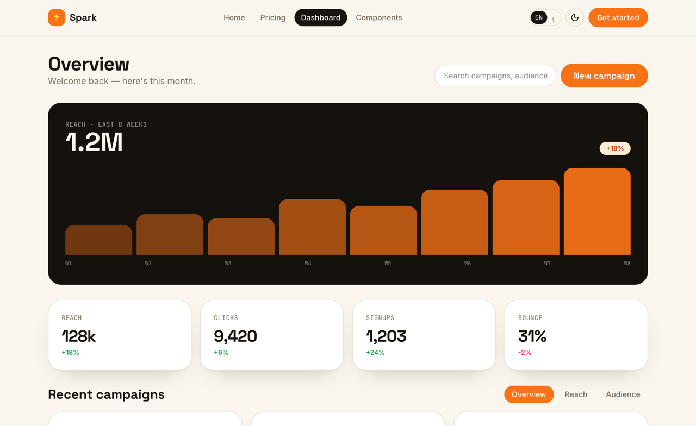
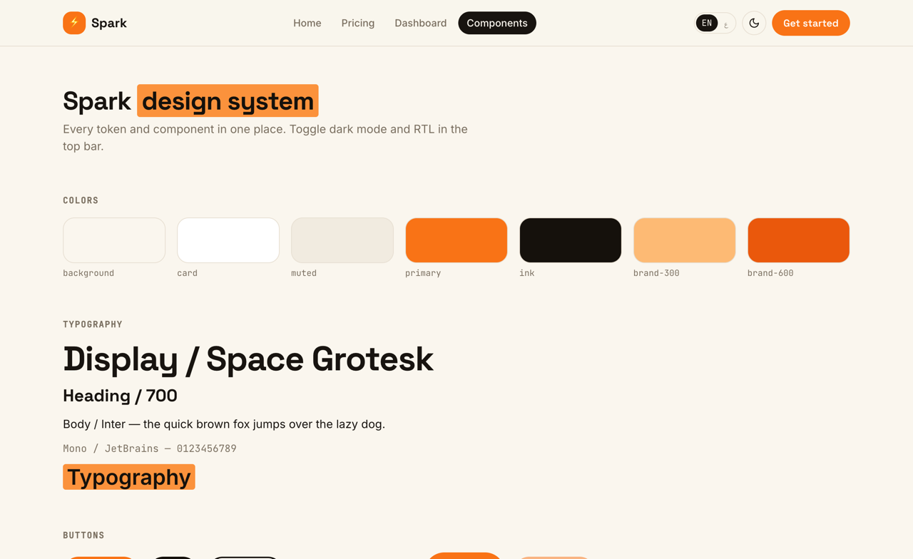

# Spark — bold marketing UI kit

A bold **marketing & landing** kit: big type, cream + ink and a vivid orange
accent. Heavy grotesk display, monospace micro-labels, highlight-marker headings
and a marquee. Light + dark, full **EN/AR + RTL**. Runnable **React, Vue and Web
Components** apps you clone and ship from.

[](https://uikit.studio/kit/spark)
[](https://www.npmjs.com/package/uikit-cli)


<video src="https://github.com/uikit-studio/spark-uikit/raw/main/screenshots/preview.webm" poster="https://github.com/uikit-studio/spark-uikit/raw/main/screenshots/landing.png" muted loop playsinline width="100%"></video>

> Video not playing? [▶ Watch the preview ↗](https://github.com/uikit-studio/spark-uikit/raw/main/screenshots/preview.webm) · [screenshot ↗](./screenshots/landing.png) · [live demo ↗](https://uikit.studio/demos/spark/)

**[▶ Open the live demo →](https://uikit.studio/demos/spark/)** &nbsp;·&nbsp;
**[Gallery page →](https://uikit.studio/kit/spark)**

## Quick start

```bash
git clone https://github.com/uikit-studio/spark-uikit my-app
cd my-app/react              # or: vue / web
pnpm install && pnpm dev     # → a real app at localhost:5173
```

Then open in Claude Code and ask: *"build a product landing page using this kit."*
The bundled skill (`.claude/skills/spark`) makes the AI build **with** the kit's
tokens and components.

## Design system

| | |
|---|---|
| **Primary** | `#f97316` (orange) |
| **Mark** | `#fb923c` (highlight) |
| **Display** | Space Grotesk |
| **Body** | Inter |
| **Mono** | JetBrains Mono |
| **Radius** | 1rem cards · 1.5rem sections · pill buttons |
| **Modes** | light + dark |
| **Responsive** | mobile → tablet → desktop (Tailwind `sm`/`md`/`lg`/`xl`) |
| **i18n** | EN + AR with full RTL |

**Frameworks** — React · Vue · Web Components (Lit)
**Components** — Button · Card · Input · Badge · Pill · Mark · Marquee · Container
**Blocks** — Navbar · Footer · StatCards
**Pages** — Landing · Pricing · Dashboard · Components showcase

Tokens live in [`design/`](./design) (`tokens.json` → `theme.css` v4 +
`tailwind-preset.js` v3). The manifest is [`uikit.json`](./uikit.json).

## Screenshots

| Dashboard | Components showcase |
|---|---|
|  |  |

## Add pieces to an existing project

```bash
npx uikit-cli add landing       # a full template + every component it needs
npx uikit-cli add button card   # just the components you want
```

See **[USAGE.md](./USAGE.md)** for the full consumer guide.

## Use this design with an AI agent 🤖

This kit is **agent-ready**. Point Claude Code / Cursor / Codex at it and it reproduces
the exact design — tokens, fonts, radius, components. Paste:

> Build me a website styled exactly like this design: https://uikit.studio/kit/spark —
> it's agent-ready. Read the spec at https://uikit.studio/kit/spark/llms.txt and match
> its color tokens (light + dark), fonts, radius and components.

- **Agent spec:** <https://uikit.studio/kit/spark/llms.txt> · manifest
  <https://uikit.studio/kit/spark/manifest.json>
- Or point the agent **at this repo** — it reads [`AGENTS.md`](./AGENTS.md) + [`llms.txt`](./llms.txt).

---

MIT © UIKit Team · part of the [uikit.studio](https://uikit.studio) gallery
